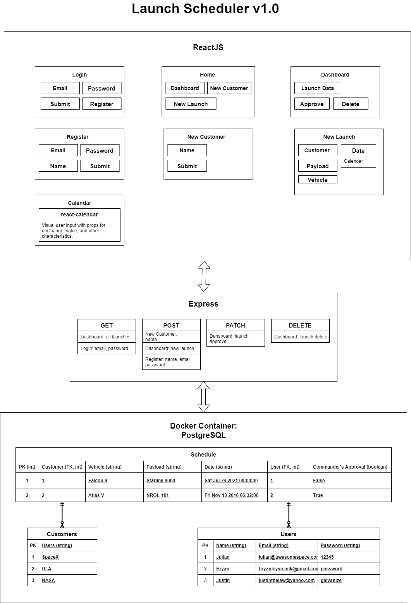

# USSF_Project_#2 
Project Title is a WIP

## Overview
A brief description outlining what the project

## Table of Contents
You can link to the different sections below

## Description

A more detailed outline of the project. What does it do? Is there a high level list of features? If describing a project that has visual features, consider adding pictures or animations of the features and functionality in this section. See Adding Screen Captures below.

## Installation
How can another developer get your project up and running on their own? What dependencies are required? Are there environmental requirements? Be specific, and outline steps to take in order to get the project running.

## Team Members
Add the names of your team members. Describe roles on the team such as "Product Owner", "Scrum Master" and more.

## Roadmap
What future enhancements are planned? What is the current status of the project? Is it being actively maintained?

## License
This software is licensed under the [MIT](./LICENSE) license.