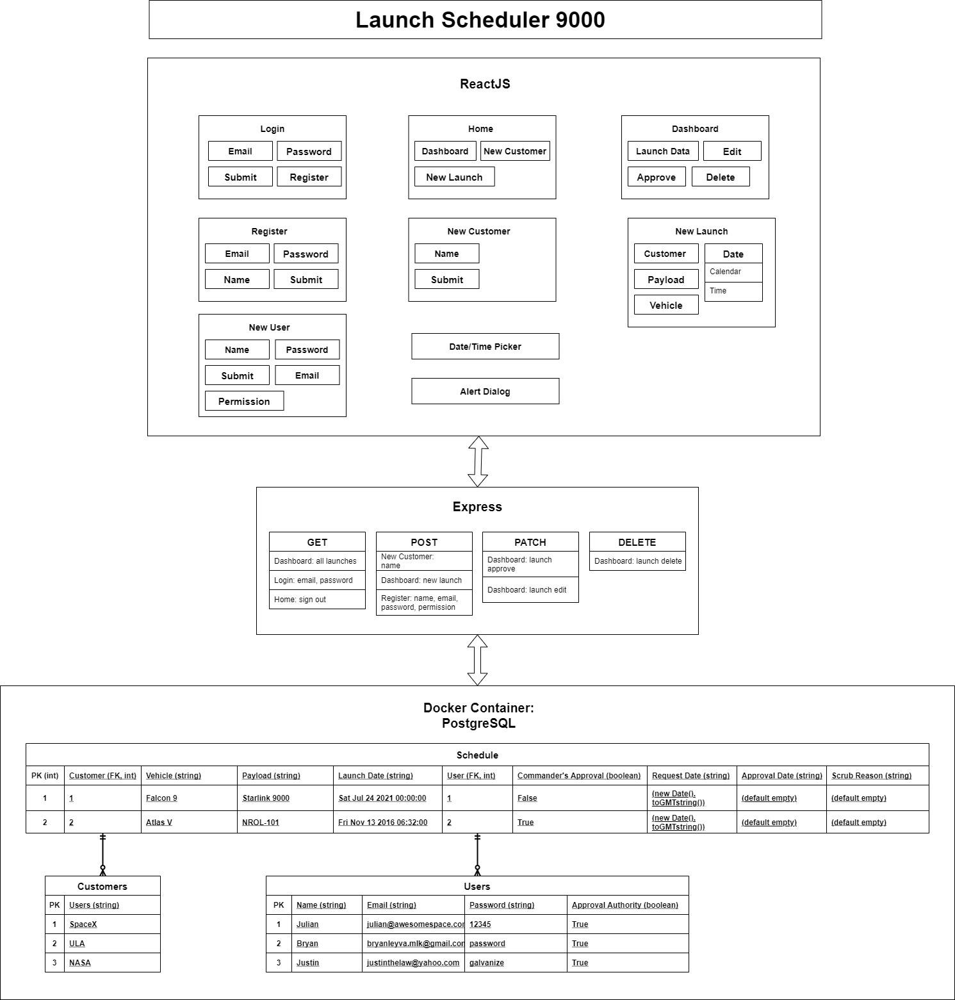

# USSF_Project_#2
Launch Scheduler 5000

## Overview
Launch Scheduler 5000 allows the users to keep a history of launch requests and whether they are approved

## Table of Contents
You can link to the different sections below

## Description

## Installation
User will need to create db on postgres "project2db"

npm install from both /backend and /front end folders

populate the database with
    npx knex migrate:latest
    npx knex seed:run

npm start from the backend

npm start from the front end

enjoy the app

## Team Members

 - Bryan Leyva: Project Commander; the fate of the project rests on his shoulders
    - 
 - Justin Law: Lead software developer; decideds all critical implementations
    - 
 - Julian Heinze: Founder; came up with the name of the app
    - 

## Roadmap
Future enhancements:
    Only show current launch dates that haven't launched yet.
    Tweak the delete button, (still need to maintain 10 year history of records)
    Do verification of edits (currently you can submit an edit with no changes which causes CC Approval => false)
    Current state of project is 'useable' however, limited
    App is only being maintained for this week 7/9/2021, until viability can be confirmed

## License
This software is licensed under the [MIT](./LICENSE) license.